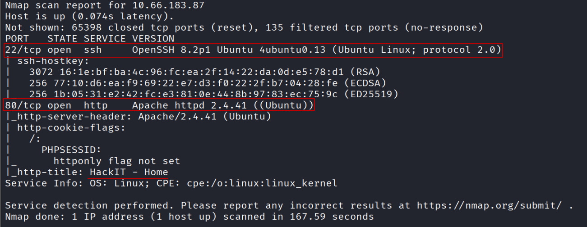

# RootMe

### Objetivos del laboratorio

- Identificar servicios expuestos en el host objetivo.
- Enumerar la superficie de ataque del servicio web.
- Obtener acceso inicial mediante una funcionalidad de carga de archivos.
- Realizar escalada de privilegios hasta el usuario con máximos privilegios.
- Documentar comandos, evidencias y hallazgos de forma reproducible.

### Habilidades a poner en práctica

- Reconocimiento y enumeración (Nmap).
- Enumeración web (WhatWeb, Nikto, Gobuster, revisión de código fuente).
- Explotación de carga de archivos y obtención de ejecución remota de comandos (RCE).
- Gestión de shells reversas y estabilización de TTY.
- Escalada de privilegios mediante binarios con SUID (GTFOBins).

### IP objetivo

**10.66.183.87**

### 1) Reconocimiento inicial

Se realizó un escaneo completo de puertos y detección de servicios:

```bash
nmap -T5 -sS -sCV -p- --stats-every=5s -Pn 10.66.183.87
```



**Resultado:** Se identificaron únicamente los servicios **SSH** y **HTTP** expuestos en el host. Por lo anterior, se priorizó el análisis del servicio **HTTP**.

### 2) Enumeración del servicio HTTP

Para el análisis del servicio web se utilizaron **Gobuster**, **Nikto**, **WhatWeb** y la revisión del **código fuente**.

#### Nikto

```bash
nikto -h http://10.66.183.87/
```

#### Gobuster

```bash
gobuster dir -u http://10.66.183.87/ -w /usr/share/wordlists/dirbuster/directory-list-lowercase-2.3-medium.txt -t 100
```


#### WhatWeb

```bash
whatweb http://10.66.183.87/
```


#### Revisión de código fuente


### 3) Hallazgo relevante

A partir de los resultados anteriores, se identificó una funcionalidad de **carga de archivos** que sugiere validaciones insuficientes.


El comportamiento observado sugiere que el formulario permite la carga de múltiples tipos de archivo y que no existe una lista clara de extensiones permitidas (o bien, las validaciones son débiles).


La existencia del directorio **uploads** incrementa el riesgo, ya que abre la posibilidad de ejecutar contenido subido y derivar en **RCE (Remote Code Execution)**.


Dado que se contaba con un punto de carga y una ruta potencial para acceder a los archivos subidos, se preparó una **reverse shell** (por ejemplo, con apoyo de [https://www.revshells.com/](https://www.revshells.com/)).


Se creó un archivo que contiene el payload de reverse shell. Como práctica operativa, se recomienda utilizar nombres no descriptivos (por ejemplo, un hash) para reducir el riesgo de que un tercero identifique y abuse del archivo durante la ventana de pruebas.


Una vez listo, se intentó subir el archivo. Se observó que la extensión **.php** no estaba permitida:


Esto sugiere un control por **lista negra** (bloqueo explícito de extensiones conocidas). Por ello, se probaron extensiones alternativas asociadas a PHP, como **.php5**, **.phtml**, **.phar**, entre otras:


En este caso, la carga fue exitosa. A continuación, se accedió al archivo desde el directorio **uploads**:


Al abrir el archivo, se observó lo siguiente:


Para evitar el error observado, fue necesario levantar un listener en una nueva terminal, utilizando el puerto definido en el payload (4443):


Posteriormente, se recargó la ejecución del archivo y se obtuvo la shell con éxito:


### 4) Estabilización de TTY

Se realizó el tratamiento de TTY para mejorar la interacción con la sesión obtenida:

1. Spawnear TTY:

```bash
python3 -c 'import pty; pty.spawn("/bin/bash")'
```

1. Suspender el proceso:

```
Ctrl + Z
```

1. Ajustar terminal y volver al foreground (en la máquina atacante):

```bash
stty raw -echo; fg
```

1. Exportar la variable de terminal (en la víctima):

```bash
export TERM=xterm
```

### 5) Post-explotación y enumeración local

Una vez estabilizada la sesión, se enumeraron los usuarios existentes:


Se identificaron los siguientes usuarios:

- root
- rootme
- test
- ubuntu

Se intentó listar privilegios sudo del usuario actual (**www-data**) con `sudo -l`:


La acción no fue posible debido a que no se contaba con la contraseña requerida. A continuación, se revisaron directorios en **/home** para identificar información de interés:


En este caso, no se identificó información relevante a simple vista. Se intentó revisar el historial de comandos del usuario **rootme**:

```bash
cat /home/rootme/.bash_history
```


No se contaba con permisos para acceder al archivo. Sin embargo, al profundizar en el directorio **/var/www** se encontró el archivo **user.txt**:


El archivo corresponde a una *flag*. Para continuar con la escalada de privilegios, se enumeraron binarios con bit **SUID**, los cuales pueden ejecutarse con privilegios del propietario (frecuentemente **root**). Se utilizó el siguiente comando:

```bash
find / -perm -u=s -type f 2>/dev/null
```


### 6) Escalada de privilegios (SUID)

De los binarios identificados, los siguientes resultaron de mayor interés. Para validar vectores de abuso se consultó **GTFOBins**: [https://gtfobins.org/](https://gtfobins.org/).

#### Caso: Python con SUID


Comando utilizado:

```bash
python -c 'import os; os.execl("/bin/sh", "sh", "-p")'
```

**Explicación técnica:**

- Si `python` cuenta con el bit **SUID** y pertenece a **root**, el intérprete se ejecuta con privilegios efectivos elevados.
- `os.execl(...)` reemplaza el proceso actual (Python) por `/bin/sh`.
- El argumento `-p` solicita a `sh` no descartar los privilegios efectivos, por lo que se mantiene el contexto privilegiado heredado del binario SUID.


### 7) Cierre

Escalada de privilegios completada con éxito. Se obtuvo control con privilegios elevados y se finalizó la máquina:


