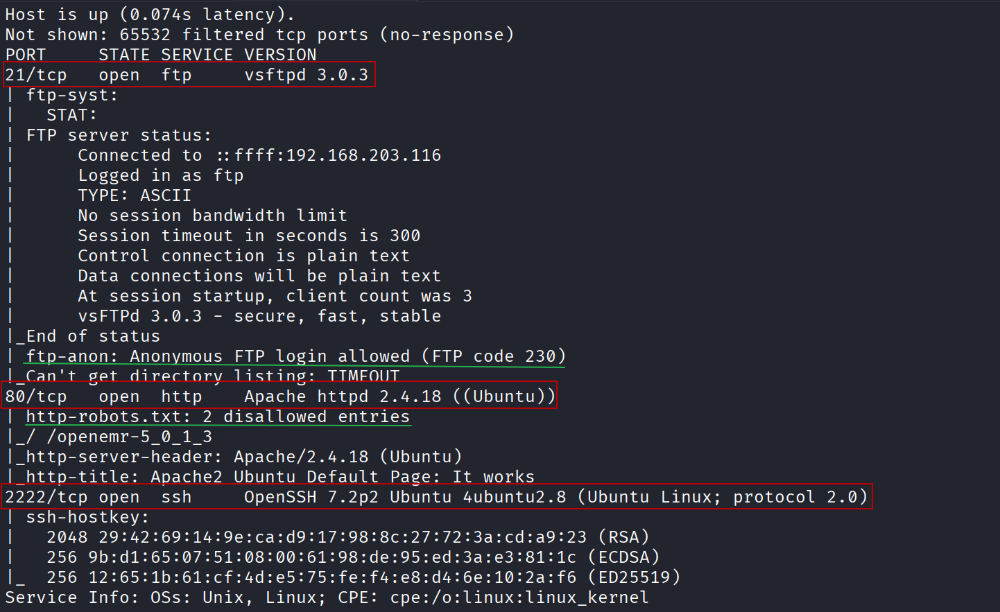

# Simple CTF

### Target

- Target IP: `10.67.138.41`

### Reconnaissance

A complete port scan and service detection were performed with Nmap:

```bash
nmap -T5 -sS -sCV -p- --stats-every=5s -Pn 10.67.138.41
```



Based on the results, **FTP**, **HTTP**, and **SSH** services were identified. In addition:

- **Anonymous** access enabled on FTP.
- Presence of `robots.txt` in the HTTP service.

Next, the enumeration of the FTP service was prioritized.

### FTP enumeration

The content available with anonymous access was enumerated.


The file found contained the following clue:


> "Damn, man... you're the worst developer I've ever seen. You gave the system user the same password, and it's so weak... I cracked it in seconds. God... what a disaster."
> 

This message suggests that **the password matches the username**. Therefore, the next goal is to identify a valid user for authentication on the web panel or via SSH.

### HTTP enumeration

We continued enumerating the web service using `Nikto`, `WhatWeb`, and `Gobuster`.

```bash
nikto -h http://10.67.138.41/
```


```bash
whatweb http://10.67.138.41/
```


```bash
gobuster dir -u http://10.67.138.41/ -w /usr/share/wordlists/dirbuster/directory-list-lowercase-2.3-medium.txt
```


Source code review (no relevant findings):


The relevant findings were `robots.txt` and the `/simple` directory. When accessing these paths, the following was observed:


A CMS was identified and a possible user was obtained, in addition to the version (**CMS Made Simple 2.2.8**):


Authentication was attempted with the user found, but it was not valid for the administration panel:


Similarly, attempts were made via SSH without success at this stage:


### Exploit search

Public exploits were searched for the detected version:

```bash
searchsploit "CMS Made Simple" 2.2.8
```


Based on the results, an applicable vulnerability was selected to retrieve credentials and access the administration panel:


The exploit includes examples of use and variables to be used:


The exploit was executed with the indicated syntax:

```bash
python2 46635.py -u http://10.67.138.41/simple --crack -w /usr/share/wordlists/rockyou.txt
```


Crack result:


With these credentials, it was possible to log in:

- `mitch` → `secret`


### Web shell attempt (not viable)

An attempt was made to create a *web shell* in the CMS by adding a section that would interpret PHP code:


As a best practice, a hash-like name was used to reduce third-party access to the *web shell*:


The file with the payload was uploaded:


```php
<?php system($_GET['cmd']); ?>
```

In this case, the CMS did not accept files with the `.php` extension. Before attempting alternative techniques, the credentials recovered over SSH were validated.

### Initial access (SSH)


```bash
ssh mitch@10.67.138.41 -p 2222
```

```bash
/bin/bash
```


### Local enumeration

Enumeration of local directories and resources:


### Privilege escalation

The user's sudo permissions were reviewed:


The permission indicates that `vim` can be executed as **root**. To obtain a privileged shell:

```bash
sudo vim -c ':!/bin/bash'
```


### Flags and completion

With root privileges, the required flags were obtained:


The responses requested by the platform were recorded:


Challenge completed:

